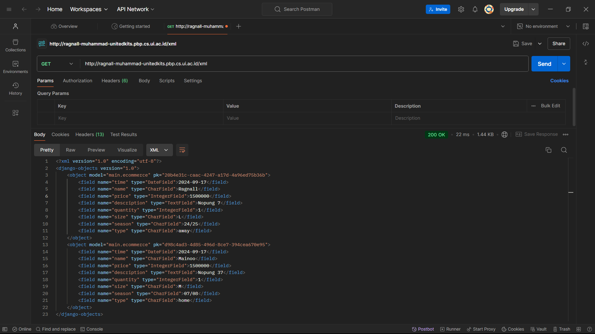

# Table of Contents

## Link 
[UnitedKits](http://ragnall-muhammad-unitedkits.pbp.cs.ui.ac.id/)

## Tugas: 
[Tugas 2](#Tugas-2) <br>
[Tugas 3](#Tugas-3) <br>
[Tugas 4](#Tugas-4) <br>
[Tugas 5](#Tugas-5) <br>
[Tugas 6](#Tugas-6) <br>

---

## Tugas 2
### 1. Jelaskan bagaimana cara kamu mengimplementasikan checklist di atas secara step-by-step (bukan hanya sekadar mengikuti tutorial).
a. Membuat sebuah proyek Django baru
- Membuat folder di lokal (Laptop sendiri)
- Membuka folder itu pada powershell, membuat virtual environment python, lalu meng-install depedencies yg dibutuhkan
- jalankan "django-admin startproject nama_proyek ." pada terminal
- Membuat repo di github
- inisiasi repo (pastikan ada .gitignore yang diperlukan)

b. Membuat aplikasi dengan nama main pada proyek tersebut.
- Jalankan "python manage.py startapp main" untuk membuat aplikasi bernama main

c. Melakukan routing pada proyek agar dapat menjalankan aplikasi main.
- masukkan string 'main' ke dalam settings.py yang ada di folder proyek di bagian INSTALLED_APPS
- Memasukkan "localhost" dan "127.0.0.1" ke settings.py di tempat yang sama di bagian ALLOWED_HOSTS
- membuat folder baru bernama templates di dalam folder main, lalu membuat file bernama main.html yang akan menampilkan website yang diinginkan, main.html diisi oleh atribut yang akan dibuat seperti {{ nama_atribut }}

d. Membuat model pada aplikasi main dengan nama Product dan memiliki atribut wajib sebagai berikut. (name,price,description)
- Edit models.py pada direktori main, lalu import models dari Django
- membuat class dengan parameter models.Model lalu buat atribut yang diinginkan pada class itu,
name sebagai nama item dengan tipe CharField.
price sebagai harga item dengan tipe IntegerField.
description sebagai deskripsi item dengan tipe TextField.
dan atribut lain yang kiranya dibutuhkan
- membuat method yang akan digunakan pada unit test untuk mengecek kebenaran kode
- melakukan migration setelah meng-edit models.py, "python manage.py makemigrations" lalu "python manage.py makemigrations"

e. Membuat sebuah fungsi pada views.py untuk dikembalikan ke dalam sebuah template HTML yang menampilkan nama aplikasi serta nama dan kelas kamu.
- Edit views.py pada direktori main dengan mengimport render dari Django dan menambahkan method show_main dengan paramater request
- Membuat dictionary yang berisi semua atribut yang dibuah pada models sebagai key dan value tiap atribut sebagai valuenya
- lalu return method render dengan parameter request, main.html, dan nama variabel dictionary

f. Membuat sebuah routing pada urls.py aplikasi main untuk memetakan fungsi yang telah dibuat pada views.py.
- Edit urls.py di folder main dengan

from django.urls import path
from main.views import show_main

app_name = 'main'

urlpatterns = [
    path('', show_main, name='show_main'),
]

- Edit juga urls.py di folder proyek dengan mengimport include dan menambahkan 
path('', include('main.urls')),
pada urlpatterns

g. Melakukan deployment ke PWS terhadap aplikasi yang sudah dibuat sehingga nantinya dapat diakses oleh teman-temanmu melalui Internet.
- Create new project pada website PWS
- masukkan url PWS pada ALLOWED_HOSTS di folder main settings.py
- ikuti perintah pada web PWS

h. Membuat sebuah README.md yang berisi tautan menuju aplikasi PWS yang sudah di-deploy, serta jawaban dari beberapa pertanyaan berikut.

https://ragnall-muhammad-unitedkits.pbp.cs.ui.ac.id/

http://ragnall-muhammad-unitedkits.pbp.cs.ui.ac.id/

### 2. Buatlah bagan yang berisi request client ke web aplikasi berbasis Django beserta responnya dan jelaskan pada bagan tersebut kaitan antara urls.py, views.py, models.py, dan berkas html.


### 3. Jelaskan fungsi git dalam pengembangan perangkat lunak!
Dengan git, orang - orang bisa mengerjakan proyek bersama - sama dalam waktu yang sama. Hal ini dapat dilakukan dengan branching dalam git, suatu developer bisa mengerjakan fitur A dan developer lain bisa mengerjakan fitur lainnya. git juga bisa dijadikan backup, karena dengan git sebuah proyek disimpan di "dua" tempat, lokal developer masing - masing dan juga disimpan di github.

### 4. Menurut Anda, dari semua framework yang ada, mengapa framework Django dijadikan permulaan pembelajaran pengembangan perangkat lunak?
Karena Django menggunakan MVT yang friendly untuk pemula yang mengajarkan dasar - dasar. MVT memudahkan kode untuk dikelola, kode juga dapat digunakan kembali dalam berbagai bagian aplikasi yang berbeda, dan juga memisahkan tugas antara logika aplikasi, tampilan, dan data. Django juga menggunakan Python yang juga merupakan bahasa pemrograman untuk pemula.

### 5. Mengapa model pada Django disebut sebagai ORM?
Model pada Django disebut ORM karena Django menggunakan sistem Object Relational Mapping. Object Relational Mapping adalah teknik memanipulasi data dari database menggunakan paradigma object-oriented.

---

## Tugas 3

### 1. Jelaskan mengapa kita memerlukan data delivery dalam pengimplementasian sebuah platform?
Kita perlu data delivery dalam pengimplementasian sebuah platform karena data delivery yang efisien memastikan website/app berjalan dengan lancar, sehingga memberikan user experience baik.

### 2. Menurutmu, mana yang lebih baik antara XML dan JSON? Mengapa JSON lebih populer dibandingkan XML?
Menurut saya, tidak bisa dikatakan secara objektif yang lebih baik antara XML dan JSON, mereka memiliki kelebihan dan kekurangan masing - msaing. Alasan JSON lebih populer dibandingkan XML adalah karena beberapa hal:
<br>1. JSON lebih mudah untuk dibaca/ditulis dibandingkan XML
<br>2. Sebagian besar language dan framework modern memiliki built-in support untuk JSON
<br>3. Banyak web API yang lebih memilih JSON karena lebih mudah diintegrasikan dengan aplikasi berbasis JavaScript

### 3. Jelaskan fungsi dari method is_valid() pada form Django dan mengapa kita membutuhkan method tersebut?
is_valid() adalah method yang memeriksa apakah data di form yang dikirimkan oleh user valid sesuai validasi yang ditentukan. Method ini penting karena kita dapat memastikan kebenaran data dan menjaga dari input berbahaya.

### 4. Mengapa kita membutuhkan csrf_token saat membuat form di Django? Apa yang dapat terjadi jika kita tidak menambahkan csrf_token pada form Django? Bagaimana hal tersebut dapat dimanfaatkan oleh penyerang?
Kita menggunakan csrf_token untuk memastikan request asli dan berasal dari orang yang diinginkan. <br>
Tanpa csrf_token, seseorang bisa mendapatkan akses ke aplikasi yang tidak sah<br>
Penyerang membuat request yang mengatasnamakan user, tanpa csrf_token, request asli dan request berbahaya tidak dapat bisa dibedakan

### 5. Jelaskan bagaimana cara kamu mengimplementasikan checklist di atas secara step-by-step (bukan hanya sekadar mengikuti tutorial).
a. Membuat input form untuk menambahkan objek model pada app sebelumnya.
- membuat file forms.py di folder main dan membuat class dengan parameter ModelForm (import ModelForm dari django), lalu di dalam class itu membuat class Meta yang berisi dua variabel, model yang di assign object dari models.py, dan fields yang berupa list dengan beberapa string yang akan diminta inputnya
- membuat html untuk tempat input form di folder templates di dalam folder main
- masih di folder main, menambahkan method pada views.py dan juga menambahkan path yang sesuai di urls.py

b.Tambahkan 4 fungsi views baru untuk melihat objek yang sudah ditambahkan dalam format XML, JSON, XML by ID, dan JSON by ID.
- membuat 4 method di views.py, dengan sebuah variabel yang mengambil semua instance models.py dari database, untuk yang by ID hanya mengambil sesuai IDnya
- lalu return menggunakan HTTPResponse dengan tipe yang sesuai (xml/json)

c. Membuat routing URL untuk masing-masing views yang telah ditambahkan pada poin 2.
- menambahkan path yang sesuai pada urls.py
  

### 6 Mengakses keempat URL di poin 2 menggunakan Postman, membuat screenshot dari hasil akses URL pada Postman, dan menambahkannya ke dalam README.md.

<br>

#### XML


#### JSON


#### XML-ID


#### JSON-ID


---

## Tugas 4
### 1. Apa perbedaan antara HttpResponseRedirect() dan redirect()
Keduanya berfungsi untuk mengarahkan user ke URL yang berbeda. Perbedaanya, HttpResponseRedirect() memerlukan URL lengkap sebagai input. Sedangkan redirect() dapat menerima URL, nama view, atau objek model, lalu "redirect" ke URL yang benar/sesuai.

### 2. Jelaskan cara kerja penghubungan model Product dengan User!
Pada file models.py di folder main, pada model Product (ECommerce utk unitedkits) dibuah sebuah atribut/variabel bernama user yang berisi models.ForeignKey(User, on_delete=models.CASCADE), dengan foreign key ini, semua Product akan terhubung dengan satu User. Product yang dibuat akan menyimpan referensi ke user dalam bentuk foreign key, sehingga satu model product hanya dimiliki satu orang User, sedangkan satu User bisa memiliki lebih dari satu model product.

### 3. Apa perbedaan antara authentication dan authorization, apakah yang dilakukan saat pengguna login? Jelaskan bagaimana Django mengimplementasikan kedua konsep tersebut.
Authentication adalah proses verifikasi user, sedangkan authorization adalah proses setelah Authentication yang memeriksa/menentukan izin/permission si User. Saat login, yang terjadi adalah authentication, setelah login berhasil baru dilakukan authorization. <br>
Django mengimplementasi Authentication pada django.contrib.auth, sedangkan implementasi Authorization dalam bentuk sistem Permissions dan Groups.

### 4. Bagaimana Django mengingat pengguna yang telah login? Jelaskan kegunaan lain dari cookies dan apakah semua cookies aman digunakan?
Django mengingat user yang telah login dengan cookies. Cookies bisa digunakan untuk mengingat preferensi/setting User, memberikan personalized ads (analisis user), memberitahu chapter terakhir yang dibaca (website novel/komik), dll. Namun, tidak semua cookies aman untuk digunakan. Cookies yang menyimpan password/data pribadi bisa menjadi target penyerang, maka cookies harus dipastikan keamanannya.

### 5. Jelaskan bagaimana cara kamu mengimplementasikan checklist di atas secara step-by-step (bukan hanya sekadar mengikuti tutorial).
a. Mengimplementasikan fungsi registrasi, login, dan logout untuk memungkinkan pengguna untuk mengakses aplikasi sebelumnya dengan lancar.
- Meng import method yang diperlukan dari django.contrib.auth serta django.http
- Menambahkan @login_required(login_url='/login') di atas method show_main di views.py
- Membuat method register, login, dan logout pada views.py
- Menambahkan path yang sesuai pada urls.py

b. Membuat dua akun pengguna dengan masing-masing tiga dummy data menggunakan model yang telah dibuat pada aplikasi sebelumnya untuk setiap akun di lokal.
- Jalankan python manage.py runserver pada terminal
- Buka http://localhost:8000/ pada browser favorit
- Pencet "Register Now" lalu buatlah sebuah user, lakukan hal ini dua kali
- Login ke user 1, buat 3 order, logout lalu lakukan yang sama untuk user 2 

c. Menghubungkan model Product dengan User
- Pada class ECommerce (nama class menyesuaikan) di models.py, buat lah variabel/atribut user yang berisi models.ForeignKey(User, on_delete=models.CASCADE)
- Pada views.py, edit method show_main dan create_order
- Pada show_main, ubah NamaModel.objects.all(), menjadi NamaModel.objects.filter(user=request.user)
- Pada create_order, ubah form.save() menjadi 3 line yang berisi
        <br>1. order_entry = form.save(commit=False)
        <br>2. order_entry.user = request.user
        <br>3. order_entry.save()

d. Menampilkan detail informasi pengguna yang sedang logged in seperti username dan menerapkan cookies seperti last login pada halaman utama aplikasi.
- Edit show_main pada views.py dan ganti value dari key name dengan request.user.username serta tambahkan key dan value baru berupa 'last_login': request.COOKIES['last_login']

---

## Tugas 5
### 1. Jika terdapat beberapa CSS selector untuk suatu elemen HTML, jelaskan urutan prioritas pengambilan CSS selector tersebut!
CSS Specificity:
1. Inline styles - Contoh: `<h1 style="color: pink;">`
2. IDs - Contoh: `#navbar`
3. Classes, pseudo-classes, attribute selectors - Contoh: `.test, :hover, [href]`
4. Elements and pseudo-elements - Contoh: `h1, ::before`

Pengecualian aturan ini adalah penggunaan `!important`, yang akan menjadi prioritas tertinggi

Jika dua selector memiliki tingkat prioritas yang sama, yang ditulis terakhir akan diambil.

### 2. Mengapa responsive design menjadi konsep yang penting dalam pengembangan aplikasi web? Berikan contoh aplikasi yang sudah dan belum menerapkan responsive design!

Responsive design penting dalam pengembangan aplikasi web karena dengan responsive design, aplikasi web dapat terlihat baik dalam berbagai perangkat dengan ukuran layar berbeda (mobile, laptop, etc.)

Contoh yang sudah menerapkan:
- Youtube.com

Contoh yang belum menerapkan:
- SIAK-NG

### 3. Jelaskan perbedaan antara margin, border, dan padding, serta cara untuk mengimplementasikan ketiga hal tersebut!
- Margin: Area di luar border yang memisahkan elemen dari elemen lainnya dan mengontrol jarak antar elemen.

- Border: Garis di sekitar padding dan konten elemen. Border memberikan batas visual pada elemen.

- Padding: Ruang antara konten elemen dan border. Padding menambahkan jarak di dalam elemen antara konten dan batas border.

```css
div {
  margin: 10px;
  border: 3px solid red;
  padding: 5px;
}
```

### 4. Jelaskan konsep flex box dan grid layout beserta kegunaannya!
- Flexbox: Flexbox digunakan untuk membuat layout yang fleksibel. Elemen-elemen di dalam container dapat secara otomatis menyesuaikan ukuran berdasarkan ruang yang tersedia.

- Grid Layout: Grid layout digunakan untuk membuat layout dua dimensi (baris dan kolom). Dengan Grid, kita bisa menentukan berapa banyak kolom dan baris yang ada dalam layout dan bagaimana elemen ditempatkan di dalam grid tersebut.


### 5. Jelaskan bagaimana cara kamu mengimplementasikan checklist di atas secara step-by-step (bukan hanya sekadar mengikuti tutorial)!

a. Implementasikan fungsi untuk menghapus dan mengedit product.
- Menambahkan method edit dan delete pada views.py, menambahkan path yang sesuai pada urls.py, lalu untuk edit membuat edit_order.html pada main/templates.

b. Kustomisasi halaman login, register, dan tambah product semenarik mungkin.
- Menggunakan tailwind untuk men-dekorasi login, register, dan create_order 

c. Jika pada aplikasi belum ada product yang tersimpan, halaman daftar product akan menampilkan gambar dan pesan bahwa belum ada product yang terdaftar.
- Mengecek apakah `ECommerce.objects.filter(user=request.user)` ada isinya atau tidak, jika tidak, menampilkan gambar yang terdapat pada folder static yang sesuai

d. Jika sudah ada product yang tersimpan, halaman daftar product akan menampilkan detail setiap product dengan menggunakan card (tidak boleh sama persis dengan desain pada Tutorial!).
- Mengecek apakah `ECommerce.objects.filter(user=request.user)` ada isinya atau tidak, jika ada, menampilkan semua produk dengan card_order.html yang sudah dibuat

e. Untuk setiap card product, buatlah dua buah button untuk mengedit dan menghapus product pada card tersebut!
- Menambahkan button dengan implementasi edit dan delete order lalu menambahkan tombol dengan SVG yang didapat dari https://tabler.io/icons

f. Buatlah navigation bar (navbar) untuk fitur-fitur pada aplikasi yang responsive terhadap perbedaan ukuran device, khususnya mobile dan desktop.
- Membuat navbar.html, dan juga menambahkan `<div class="mobile-menu hidden...` untuk tampilan navbar pada mobile

---

## Tugas 6

### 1. Jelaskan manfaat dari penggunaan JavaScript dalam pengembangan aplikasi web!
Dengan menggunakan JavaScript pada pengembangan aplikasi web, terdapat beberapa manfaat, di antara lain,
Interaktif, Responsif, Manipulasi DOM, Asynchronous Requests, serta dapat digunakan secara Cross-Platform

### 2. Jelaskan fungsi dari penggunaan await ketika kita menggunakan fetch()! Apa yang akan terjadi jika kita tidak menggunakan await?
Await digunakan untuk menunggu hasil dari promise yang di-return oleh fetch() karena fetch() bersifat asinkron.

Jika tidak menggunakan await maupun .then(), program akan melanjutkan eksekusi sebelum fetch() selesai, sehingga hasil data dari fetch belum ada.

### 3. Mengapa kita perlu menggunakan decorator csrf_exempt pada view yang akan digunakan untuk AJAX POST?
Dekorator csrf_exempt digunakan untuk menghindari pengecekan token CSRF pada request POST yang dikirim melalui AJAX

### 4. Pada tutorial PBP minggu ini, pembersihan data input pengguna dilakukan di belakang (backend) juga. Mengapa hal tersebut tidak dilakukan di frontend saja?
Melakukan pembersihan data hanya di frontend berpotensi membuat aplikasi vulnerable terhadap serangan. Penyerang dapat melewati validasi di frontend dengan memodifikasi request sebelum dikirim ke server.

### 5.Jelaskan bagaimana cara kamu mengimplementasikan checklist di atas secara step-by-step (bukan hanya sekadar mengikuti tutorial)!


a. Ubahlah kode cards data mood agar dapat mendukung AJAX GET. <br>

* Mengubah pengambilan order_entries dari menggunakan for loop Django menjadi menggunakan javascript yang memasukkan data order_entries pada id yang sesuai

```JS
<div id="order_cards"></div>
...
document.getElementById("order_cards").className = classNameString;
document.getElementById("order_cards").innerHTML = htmlString;
```

b. Lakukan pengambilan data mood menggunakan AJAX GET. Pastikan bahwa data yang diambil hanyalah data milik pengguna yang logged-in. <br>

* Menambahkan fungsi ini pada script html terkait,

```JS
 async function getOrderEntries() {
    return fetch("").then((res) => res.json());
  }
```

* Dengan show_json yang mengambil data berdasarkan User
```
data = ECommerce.objects.filter(user=request.user)
```
<br>

c. Buatlah sebuah tombol yang membuka sebuah modal dengan form untuk menambahkan mood. <br>

* Menambahkan button pada html terkait
```JS
<button data-modal-target="..." data-modal-toggle="..." class="..." onclick="showModal();">
      Add New Order by AJAX
    </button>
```
 * Dengan showModal() berupa function yang menunjukan form yang dibuat pada modal

d. Buatlah fungsi view baru untuk menambahkan mood baru ke dalam basis data. <br>

* Membuat fungsi dengan dekorator @csrf_exempt dan @require_POST
* Membuat variabel sesuai form dan mengambilnya menggunakan request.POST.get
* Membuat form menggunakan data yang sudah didapat, lalu form di save


e. Buatlah path /create-ajax/ yang mengarah ke fungsi view yang baru kamu buat. <br>

* Menambahkan path pada urls.py yang sesuai


f. Hubungkan form yang telah kamu buat di dalam modal kamu ke path /create-ajax/. <br>
* Membuat function addOrderEntry dengan fetch yang sesuai
```JS
fetch("", {
      method: "POST",
      body: new FormData(document.querySelector("#orderForm")),
    }).then((response) => refreshOrderEntries());
...
```


g. Lakukan refresh pada halaman utama secara asinkronus untuk menampilkan daftar mood terbaru tanpa reload halaman utama secara keseluruhan. <br>
* Membuat asynchronous function refreshOrderEntries() yang melakukan refresh data, lalu tambahkan pada fungsi addOrderEntries serta secara terpisah pada script, yang terpisah digunakan untuk menampilkan daftar order ketika pengguna pertama masuk page your_order

```JS
<script>
function addOrderEntry() {
    fetch(...
    ).then((response) => refreshOrderEntries());
}
refreshOrderEntries();
</script>
```